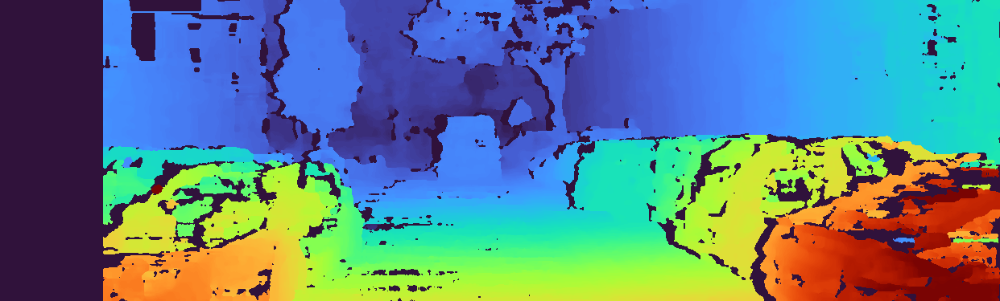
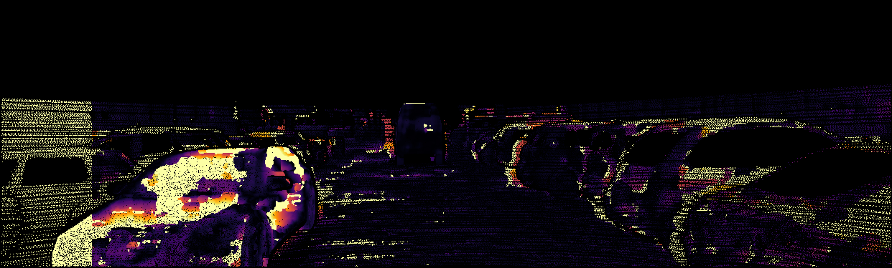
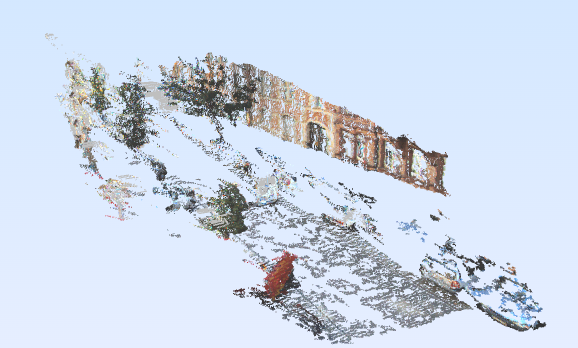

# KITTI Stereo 3D Reconstruction

A compact, evaluation-first stereo reconstruction project built around the KITTI Stereo 2012/2015 training data. It estimates dense disparity with Semi-Global Block Matching (SGBM), turns disparity into a colorized 3D point cloud, and reports disparity error against KITTI ground truth.

The images in KITTI's stereo benchmark are already rectified. This keeps the project focused on the parts that are both technically meaningful and achievable in a weekend: matching, parameter tuning, reprojection, visualization, and benchmarking.

## What it produces

For each KITTI pair the pipeline saves:

- predicted disparity and color visualization;
- absolute-error heatmap against `disp_occ_0` or `disp_noc_0`;
- a colorized `.ply` point cloud;
- pair-level and aggregate metrics in `run_summary.json`;
- optional SGBM grid-search results in `tuning_results.csv`.

## Project layout

```text
stereo_kitti/
  calibration.py       # KITTI projection-matrix parser
  disparity.py         # SGBM + optional WLS refinement
  evaluation.py        # Bad-3, KITTI-style D1, RMSE
  io.py                # image/ground-truth loading and result writers
  reconstruction.py    # dense reprojection and PLY export
run_pipeline.py        # command-line runner
tests/                 # lightweight unit tests (no KITTI download required)
```

## Quick start

Create a virtual environment, activate it, and install the two dependencies:

```powershell
python -m venv .venv
.venv\Scripts\Activate.ps1
pip install -r requirements.txt
```

Download the **training** split of [KITTI Stereo 2015](https://www.cvlibs.net/datasets/kitti/eval_scene_flow.php?benchmark=stereo) or Stereo 2012, accept its terms, and arrange the relevant directories like this:

```text
data/kitti/training/
  image_2/000000_10.png
  image_3/000000_10.png
  disp_occ_0/000000_10.png
  calib/000000.txt                 # Stereo 2015
```

`disp_noc_0/` can be used instead of `disp_occ_0/`; `--ground-truth auto` prefers the occluded map when both exist. The calibration reader handles the per-frame `calib/*.txt` layout used by KITTI 2015. If a calibration file is unavailable, the runner uses the documented KITTI defaults (`f=721.5377`, `B=0.54 m`) and records that choice.

Run five pairs:

```powershell
python run_pipeline.py --dataset data/kitti/training --max-pairs 5 --output results/baseline
```

Run a focused tuning sweep first, then inspect `results/tuning/tuning_results.csv` to select settings:

```powershell
python run_pipeline.py --dataset data/kitti/training --ids 000000_10 000001_10 000002_10 --tune --output results/tuning
```

The selected SGBM setting can then be used in a final run, for example:

```powershell
python run_pipeline.py --dataset data/kitti/training --max-pairs 10 --num-disparities 192 --block-size 5 --uniqueness-ratio 10 --output results/final
```

To request WLS refinement (available through `opencv-contrib-python`):

```powershell
python run_pipeline.py --dataset data/kitti/training --max-pairs 5 --use-wls --output results/wls
```

## Metrics

Only valid KITTI ground-truth pixels (`disparity > 0`) are evaluated.

- **Bad-3**: percentage with absolute disparity error greater than 3 px.
- **D1 / Bad-3-or-5%**: percentage where the error is greater than 3 px **and** greater than 5% of ground truth. This is closer to KITTI's published disparity criterion.
- **RMSE**: root mean squared disparity error in pixels.

The aggregate values are computed over all valid ground-truth pixels, not by simply averaging pair percentages. SGBM's left invalid margin and zero/negative predictions are treated as zero disparity, so they correctly contribute error rather than disappearing from the benchmark.

## Experimental protocol

This repository treats SGBM as a classical baseline, not a trained neural
network. The full experiment record—including metric definitions, an explicit
validation/held-out split, hypotheses for each parameter, and measured
baselines—is maintained in [EXPERIMENTS.md](EXPERIMENTS.md). The final result
must be reported only after the selected configuration is evaluated once on
the held-out image IDs.

## Final held-out result

The chosen configuration (`numDisparities=128`, `blockSize=9`,
`uniquenessRatio=5`) was selected on validation IDs `000000_10` to
`000002_10`, then locked and evaluated once on five different KITTI training
images (`000005_10` to `000009_10`). This is a reproducible held-out split
within the public training data, not an official KITTI test-server result.

| Evaluated images | Valid pixels | D1 (lower is better) | Bad-3 (lower is better) | RMSE (px) |
|---|---:|---:|---:|---:|
| `000005_10`–`000009_10` | 511,434 | **16.2764%** | **16.6643%** | **16.3709** |

The complete protocol, tuning hypotheses, per-image results, and error
analysis are in [EXPERIMENTS.md](EXPERIMENTS.md).

### Qualitative result and failure case

The following held-out example (`000006_10`) was the hardest of the five
evaluated scenes (D1 28.59%). The disparity map still captures the broad road
and vehicle-depth structure, while the error map highlights the known failure
regions of classical local matching: reflective vehicle surfaces, occlusions,
and sharp depth boundaries.

| Predicted disparity | Absolute-disparity error versus KITTI ground truth |
|---|---|
|  |  |

### Calibrated 3D reconstruction

For held-out scene `000005_10`, the final pipeline derived depth and XYZ
coordinates from the supplied camera projection matrices (`fx=721.5377 px`,
baseline `=0.532725 m`) and exported a colorized PLY point cloud. Inspection
in a point-cloud viewer shows coherent road and building surfaces at increasing
depth. Sparsity/noise around nearby cars, reflections, and occlusion boundaries
matches the disparity-error analysis above.



## Scope and limitations

- This is a **classical SGBM baseline**, not a trained deep-learning model.
- KITTI supplies rectified images; the project focuses on matching,
  reprojection, and evaluation rather than re-implementing calibration.
- The reported result is a five-image held-out split of KITTI's public
  training data. It must not be described as an official KITTI leaderboard
  submission.
- Performance varies markedly by scene; the experiment log reports this
  variation instead of hiding it behind a single aggregate number.

## Sanity checks and tests

Verify that dependencies and pure-Python logic are wired correctly:

```powershell
python -m unittest discover -s tests -v
```

The final experiment used three `_10` validation images for parameter selection and five different `_10` images for held-out evaluation. The generated `run_summary.json` retains the configuration and pixel-weighted aggregate metrics; `rectification_check.png` overlays horizontal scanlines on the first pair, where scene structure should align.

## Resume wording

> Built an evaluation-driven stereo 3D reconstruction pipeline on the KITTI Stereo 2015 dataset using OpenCV SGBM; tuned the matcher on a validation split, exported calibrated colorized PLY point clouds, and achieved 16.28% D1 / 16.66% Bad-3 on a five-scene held-out split.
